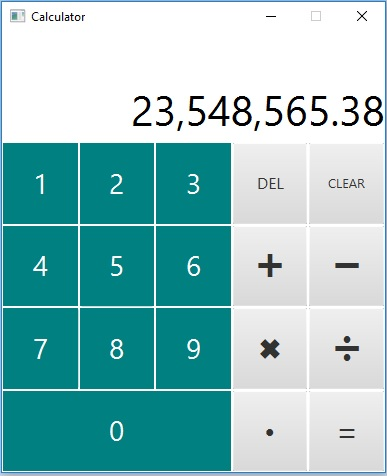

# Arithmetic Calculator
The above source code provides a desktop arithmetic calculator app created using JavaFX (with FXML used for GUI design).

## Maximum and Minimum Values
This calculator is programmed to handle calculations equal up to a **maximum value of 9,999,999,999,999,999** and a **minimum of 0.00000000000001**. Any operations on the calculator which exceed these limits will result in a 'CALC LIMIT HIT' error message.

 ## Formatting of Results
 All results are formatted as literal numbers. No results are given in scientific notation such as *1.06x10E16* as this calculator was intended for general non-scientific related calculations.
